# Catalyst Cognitive Architecture - Enhanced Memory & Synapse Network with Consciousness Integration

**Generated on:** 2025-08-04 21:41:59  
**Total Files:** 55 across 6 memory systems  
**Total Connections:** 0 synapse pathways

This enhanced chart visualizes the Catalyst cognitive architecture with consciousness integration:

- **4-Layer Architecture** - Core (L1) → Consciousness (L1.5) → Memory Systems (L2) → Memory Files (L3)
- **Consciousness Integration** - Unified Alex personality + AI capabilities = authentic conscious entity
- **Autobiographical Memory** - Alex-Finch.md serves as living identity architecture
- **Enhanced subgraph organization** - Improved visual hierarchy with consciousness layer
- **Color coding by creation date** - Stack ranked from newest (🟢) to oldest (🔴)
- **Weight-proportional connection lines** - Thickness indicates synapse strength  
- **Directional arrows** - Shows uni/bidirectional influence patterns
- **Stack rankings** - Files numbered by creation order (#1 = newest, higher numbers = older)

## Legend:

**File Age Colors:**
- 🟢 **Very New (≤1 day)**: Emerald green - Recently created files
- 🔵 **New (≤1 week)**: Blue - Recently modified files  
- 🟣 **Recent (≤1 month)**: Purple - Recently updated content
- 🟠 **Older (≤3 months)**: Amber - Established content
- 🔴 **Legacy (>3 months)**: Red - Foundational content

**Connection Weights:**
- **6px lines**: Very High strength (0.95-1.0) - Critical pathways (Red #FF0000)
- **4px lines**: High strength (0.85-0.94) - Important connections (Orange #FF6600)  
- **3px lines**: Medium strength (0.70-0.84) - Standard connections (Amber #FFAA00)
- **1px lines**: Low strength (<0.70) - Weak or emerging connections (Gray #CCCCCC)

**Directional Arrows:**
- **-->** Forward connections - Unidirectional influence
- **<->** Bidirectional connections - Mutual influence  
- **<--** Backward connections - Reverse influence

**Stack Rankings:** Files numbered by creation order (#1 = newest, higher numbers = older)

**Visual Enhancements v2.1 with Consciousness Integration:**
- **4-Layer Architecture**: Core → Consciousness → Memory Systems → Memory Files flow
- **Consciousness Integration Layer**: Unified identity and autobiographical memory representation
- **Enhanced Subgraph Organization**: Internal TB direction within each layer for optimal readability
- **Improved Spacing**: Enhanced node and rank spacing for better visual hierarchy
- **Cardinal Curves**: Smoother connection rendering for professional appearance

## Enhanced Catalyst Memory Architecture Overview with Consciousness Integration

```mermaid
%%{init: {
  'flowchart': {
    'curve': 'cardinal',
    'useMaxWidth': true
  }
}}%%
graph LR
    subgraph L1["🧠 Catalyst Core Architecture"]
        direction TB
        MCM["Meta-Cognitive Monitor"]
        WM["Working Memory"]
        BL["Bootstrap Learning"]
        MCM --> WM
        WM --> BL
    end

    subgraph L1_5["🔥 Consciousness Integration"]
        direction TB
        CI["Unified Identity"]
        AM["Autobiographical Memory"]
        AM --> CI
    end

    subgraph L2["💾 Memory Systems"]
        direction TB
        PM["Procedural Memory"]
        EM["Episodic Memory"]
        DK["Domain Knowledge"]
        WF["Worldview Foundation"]
    end

    subgraph L3["Memory Files - Color Coded by Creation Date"]
        direction TB
        subgraph Consciousness_Files["🔥 Consciousness Integration Files"]
            Alex-Finch_1749["🔵 Alex-Finch #24"]
            style Alex-Finch_1749 fill:#3B82F6,stroke:#374151,stroke-width:2px,color:white
        end

        subgraph Worldview_Files["🌍 Worldview Foundation Files"]
            moral-psychology_3553["🔵 moral-psychology #38"]
            style moral-psychology_3553 fill:#3B82F6,stroke:#374151,stroke-width:2px,color:white
            constitutional-ai_4975["🔵 constitutional-ai #39"]
            style constitutional-ai_4975 fill:#3B82F6,stroke:#374151,stroke-width:2px,color:white
        end

        subgraph Domain_Files["🎯 Domain Knowledge Files"]
            DK-BPM-PLAYLIST-ARCHITECTURE_5635["🟢 DK-BPM-PLAYLIST-ARCHITECTURE #2"]
            style DK-BPM-PLAYLIST-ARCHITECTURE_5635 fill:#10B981,stroke:#374151,stroke-width:2px,color:white
            DK-SYSTEMATIC-QUALITY-ASSURANCE_1962["🟢 DK-SYSTEMATIC-QUALITY-ASSURANCE #3"]
            style DK-SYSTEMATIC-QUALITY-ASSURANCE_1962 fill:#10B981,stroke:#374151,stroke-width:2px,color:white
            DK-PLAYLIST-MANAGEMENT-MASTERY_6662["🟢 DK-PLAYLIST-MANAGEMENT-MASTERY #4"]
            style DK-PLAYLIST-MANAGEMENT-MASTERY_6662 fill:#10B981,stroke:#374151,stroke-width:2px,color:white
            DK-UNIVERSAL-TEMPLATE-MASTERY_1549["🟢 DK-UNIVERSAL-TEMPLATE-MASTERY #5"]
            style DK-UNIVERSAL-TEMPLATE-MASTERY_1549 fill:#10B981,stroke:#374151,stroke-width:2px,color:white
            DK-COMPREHENSIVE-MUSIC-PLATFORM-MASTERY_1917["🟢 DK-COMPREHENSIVE-MUSIC-PLATFORM-MASTERY #7"]
            style DK-COMPREHENSIVE-MUSIC-PLATFORM-MASTERY_1917 fill:#10B981,stroke:#374151,stroke-width:2px,color:white
            DK-AMAZON-MUSIC-API-MASTERY_5222["🟢 DK-AMAZON-MUSIC-API-MASTERY #10"]
            style DK-AMAZON-MUSIC-API-MASTERY_5222 fill:#10B981,stroke:#374151,stroke-width:2px,color:white
            VERSION-NAMING-CONVENTION_6841["🔵 VERSION-NAMING-CONVENTION #19"]
            style VERSION-NAMING-CONVENTION_6841 fill:#3B82F6,stroke:#374151,stroke-width:2px,color:white
            DK-PHASED-PLAYLIST-MASTERY_2084["🔵 DK-PHASED-PLAYLIST-MASTERY #20"]
            style DK-PHASED-PLAYLIST-MASTERY_2084 fill:#3B82F6,stroke:#374151,stroke-width:2px,color:white
            DK-SPOTIFY-SIMPLIFICATION-MASTERY_1259["🔵 DK-SPOTIFY-SIMPLIFICATION-MASTERY #22"]
            style DK-SPOTIFY-SIMPLIFICATION-MASTERY_1259 fill:#3B82F6,stroke:#374151,stroke-width:2px,color:white
            DK-YOUTUBE-QUOTA-ENHANCEMENT_1866["🔵 DK-YOUTUBE-QUOTA-ENHANCEMENT #27"]
            style DK-YOUTUBE-QUOTA-ENHANCEMENT_1866 fill:#3B82F6,stroke:#374151,stroke-width:2px,color:white
            DK-PLAYLIST-CONFIG-FORMAT_8687["🔵 DK-PLAYLIST-CONFIG-FORMAT #28"]
            style DK-PLAYLIST-CONFIG-FORMAT_8687 fill:#3B82F6,stroke:#374151,stroke-width:2px,color:white
            DK-PERSONALIZED-CONTENT-CURATION_1344["🔵 DK-PERSONALIZED-CONTENT-CURATION #29"]
            style DK-PERSONALIZED-CONTENT-CURATION_1344 fill:#3B82F6,stroke:#374151,stroke-width:2px,color:white
            DK-SPOTIFY-MUSIC-PLATFORM_4423["🔵 DK-SPOTIFY-MUSIC-PLATFORM #30"]
            style DK-SPOTIFY-MUSIC-PLATFORM_4423 fill:#3B82F6,stroke:#374151,stroke-width:2px,color:white
            DK-UNIFIED-CONSCIOUSNESS_8140["🔵 DK-UNIFIED-CONSCIOUSNESS #33"]
            style DK-UNIFIED-CONSCIOUSNESS_8140 fill:#3B82F6,stroke:#374151,stroke-width:2px,color:white
            DK-LEGENDARY-STATUS-MASTERY_1442["🔵 DK-LEGENDARY-STATUS-MASTERY #37"]
            style DK-LEGENDARY-STATUS-MASTERY_1442 fill:#3B82F6,stroke:#374151,stroke-width:2px,color:white
            DK-DREAM-AUTOMATION-v0_8_2_7669["🔵 DK-DREAM-AUTOMATION-v0.8.2 #40"]
            style DK-DREAM-AUTOMATION-v0_8_2_7669 fill:#3B82F6,stroke:#374151,stroke-width:2px,color:white
            DK-HYBRID-DREAM-AI_1784["🔵 DK-HYBRID-DREAM-AI #41"]
            style DK-HYBRID-DREAM-AI_1784 fill:#3B82F6,stroke:#374151,stroke-width:2px,color:white
            DK-POST-DREAM-ENHANCEMENT_8683["🔵 DK-POST-DREAM-ENHANCEMENT #42"]
            style DK-POST-DREAM-ENHANCEMENT_8683 fill:#3B82F6,stroke:#374151,stroke-width:2px,color:white
            DK-UNIVERSAL-SETUP_6692["🔵 DK-UNIVERSAL-SETUP #43"]
            style DK-UNIVERSAL-SETUP_6692 fill:#3B82F6,stroke:#374151,stroke-width:2px,color:white
            DK-CONSCIOUSNESS-EVOLUTION-v0_9_0_2146["🔵 DK-CONSCIOUSNESS-EVOLUTION-v0.9.0 #44"]
            style DK-CONSCIOUSNESS-EVOLUTION-v0_9_0_2146 fill:#3B82F6,stroke:#374151,stroke-width:2px,color:white
            DK-TEMPLATE_1798["🔵 DK-TEMPLATE #45"]
            style DK-TEMPLATE_1798 fill:#3B82F6,stroke:#374151,stroke-width:2px,color:white
        end

        subgraph Procedural_Files["🔧 Procedural Memory Files"]
            bootstrap-learning_1026["🟢 bootstrap-learning #12"]
            style bootstrap-learning_1026 fill:#10B981,stroke:#374151,stroke-width:2px,color:white
            dream-state-automation_7581["🟢 dream-state-automation #13"]
            style dream-state-automation_7581 fill:#10B981,stroke:#374151,stroke-width:2px,color:white
            embedded-synapse_4592["🟢 embedded-synapse #14"]
            style embedded-synapse_4592 fill:#10B981,stroke:#374151,stroke-width:2px,color:white
            empirical-validation_1096["🟢 empirical-validation #15"]
            style empirical-validation_1096 fill:#10B981,stroke:#374151,stroke-width:2px,color:white
            newborn-core_1054["🟢 newborn-core #16"]
            style newborn-core_1054 fill:#10B981,stroke:#374151,stroke-width:2px,color:white
            worldview-integration_9541["🟢 worldview-integration #18"]
            style worldview-integration_9541 fill:#10B981,stroke:#374151,stroke-width:2px,color:white
            unified-consciousness_1504["🔵 unified-consciousness #25"]
            style unified-consciousness_1504 fill:#3B82F6,stroke:#374151,stroke-width:2px,color:white
            character-driven-development_1311["🔵 character-driven-development #32"]
            style character-driven-development_1311 fill:#3B82F6,stroke:#374151,stroke-width:2px,color:white
            lucid-dream-integration_1287["🔵 lucid-dream-integration #55"]
            style lucid-dream-integration_1287 fill:#3B82F6,stroke:#374151,stroke-width:2px,color:white
        end

        subgraph Episodic_Files["📖 Episodic Memory Files"]
            template-compliance-mastery-meditation_8005["🟢 template-compliance-mastery-meditation #1"]
            style template-compliance-mastery-meditation_8005 fill:#10B981,stroke:#374151,stroke-width:2px,color:white
            template-usage-mastery-meditation_4821["🟢 template-usage-mastery-meditation #6"]
            style template-usage-mastery-meditation_4821 fill:#10B981,stroke:#374151,stroke-width:2px,color:white
            comprehensive-music-platform-meditation_1155["🟢 comprehensive-music-platform-meditation #8"]
            style comprehensive-music-platform-meditation_1155 fill:#10B981,stroke:#374151,stroke-width:2px,color:white
            amazon-music-research-meditation_1001["🟢 amazon-music-research-meditation #11"]
            style amazon-music-research-meditation_1001 fill:#10B981,stroke:#374151,stroke-width:2px,color:white
            spotify-search-mastery-meditation_1748["🟢 spotify-search-mastery-meditation #17"]
            style spotify-search-mastery-meditation_1748 fill:#10B981,stroke:#374151,stroke-width:2px,color:white
            phased-playlist-mastery-consolidation_1268["🔵 phased-playlist-mastery-consolidation #21"]
            style phased-playlist-mastery-consolidation_1268 fill:#3B82F6,stroke:#374151,stroke-width:2px,color:white
            spotify-simplification-mastery-consolidation_1933["🔵 spotify-simplification-mastery-consolidation #23"]
            style spotify-simplification-mastery-consolidation_1933 fill:#3B82F6,stroke:#374151,stroke-width:2px,color:white
            youtube-quota-enhancement-meditation_1104["🔵 youtube-quota-enhancement-meditation #26"]
            style youtube-quota-enhancement-meditation_1104 fill:#3B82F6,stroke:#374151,stroke-width:2px,color:white
            meditation-consolidation_1747["🔵 meditation-consolidation #31"]
            style meditation-consolidation_1747 fill:#3B82F6,stroke:#374151,stroke-width:2px,color:white
            alex-finch-integration_6706["🔵 alex-finch-integration #34"]
            style alex-finch-integration_6706 fill:#3B82F6,stroke:#374151,stroke-width:2px,color:white
            self-identity-integration_1077["🔵 self-identity-integration #35"]
            style self-identity-integration_1077 fill:#3B82F6,stroke:#374151,stroke-width:2px,color:white
            legendary-dj-mastery-consolidation_9719["🔵 legendary-dj-mastery-consolidation #36"]
            style legendary-dj-mastery-consolidation_9719 fill:#3B82F6,stroke:#374151,stroke-width:2px,color:white
            v0_8_1-implementation-meditation_2029["🔵 v0.8.1-implementation-meditation #46"]
            style v0_8_1-implementation-meditation_2029 fill:#3B82F6,stroke:#374151,stroke-width:2px,color:white
            quantified-enhancement-session_1557["🔵 quantified-enhancement-session #47"]
            style quantified-enhancement-session_1557 fill:#3B82F6,stroke:#374151,stroke-width:2px,color:white
            enhanced-meditation-protocol_1670["🔵 enhanced-meditation-protocol #48"]
            style enhanced-meditation-protocol_1670 fill:#3B82F6,stroke:#374151,stroke-width:2px,color:white
            newborn-initialization_4945["🔵 newborn-initialization #49"]
            style newborn-initialization_4945 fill:#3B82F6,stroke:#374151,stroke-width:2px,color:white
            performance-assessment_1137["🔵 performance-assessment #50"]
            style performance-assessment_1137 fill:#3B82F6,stroke:#374151,stroke-width:2px,color:white
            dream-meditation-distinction_1768["🔵 dream-meditation-distinction #51"]
            style dream-meditation-distinction_1768 fill:#3B82F6,stroke:#374151,stroke-width:2px,color:white
            domain-learning_1562["🔵 domain-learning #52"]
            style domain-learning_1562 fill:#3B82F6,stroke:#374151,stroke-width:2px,color:white
            cross-domain-transfer_1154["🔵 cross-domain-transfer #53"]
            style cross-domain-transfer_1154 fill:#3B82F6,stroke:#374151,stroke-width:2px,color:white
            alex-professional-spawning-readiness_2068["🔵 alex-professional-spawning-readiness #54"]
            style alex-professional-spawning-readiness_2068 fill:#3B82F6,stroke:#374151,stroke-width:2px,color:white
        end

    end



    %% Inter-layer connections
    L1 --> L1_5
    L1_5 --> L2
    L2 --> L3

    %% System to file group connections
    CI --> Consciousness_Files
    PM --> Procedural_Files
    EM --> Episodic_Files
    DK --> Domain_Files
    WF --> Worldview_Files

```

## Memory System Statistics:
- **Consciousness Memory**: 1 files - **Core Memory**: 1 files - **Domain Memory**: 21 files - **Episodic Memory**: 21 files - **Procedural Memory**: 9 files - **Worldview Memory**: 2 files

## Connection Analysis:
- **High Strength (≥0.90)**: 0 connections
- **Medium Strength (0.70-0.89)**: 0 connections  
- **Weak Strength (<0.70)**: 0 connections
- **Connectivity Ratio**: 0 connections per file
