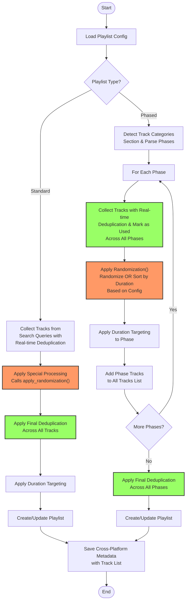

# Playlist Creation Pipeline with Randomization and Deduplication

This document outlines how the Alex Method DJ System's playlist creation pipeline works, with focus on where and how randomization and deduplication are applied.

## Playlist Creation Flow



## Pipeline Process Details

The diagram shows the complete pipeline with four key processes:

### 🔀 **Randomization Points** (Orange)
1. **Standard Playlists**: `apply_special_processing()` checks `should_randomize_tracks()` and applies randomization with time-based seed
2. **Phased Playlists**: Per-phase randomization check with unique seeds (time + phase hash)

### 📊 **Sorting Points** (Blue)
1. **Standard Playlists**: When randomization is disabled, tracks are sorted by duration (longest first)
2. **Phased Playlists**: When randomization is disabled, each phase's tracks are sorted by duration (longest first)

**Note**: Both playlist types now use consistent sorting logic - duration-based sorting (longest first) when randomization is disabled.

### 🔄 **Deduplication Points** (Green)
1. **Real-time Deduplication**: During track collection (both ID and name+artist matching)
2. **Cross-phase Tracking**: Tracks marked as used across all phases to prevent duplicates
3. **Final Deduplication**: Applied after all tracks collected to catch any remaining duplicates

### 🎯 **Duration Targeting**
Applied after randomization and deduplication to select optimal track combinations

## Key Implementation Details

### Standard Playlist Flow:
1. `search_tracks()` → `has_track_categories()` returns `false`
2. Collect tracks from `search_queries` section with real-time deduplication
3. Call `apply_special_processing()` which calls `apply_randomization()`:
   - **If randomization enabled**: Apply randomization with time-based seed
   - **If randomization disabled**: Sort tracks by duration (longest first)
4. Apply `apply_final_deduplication()` across all collected tracks
5. Apply duration targeting to processed tracks
6. Create/update playlist

### Phased Playlist Flow:
1. `search_tracks()` → `has_track_categories()` returns `true`
2. Call `create_phased_playlist()` and parse phases from `## Track Categories`
3. For each phase:
   - Collect tracks from phase-specific queries with real-time deduplication
   - Simultaneously mark tracks as used via `add_track_to_dedup_sets()` during collection
   - Call `apply_randomization()`:
     - **If randomization enabled**: Apply randomization with phase-specific seed (time + phase hash)
     - **If randomization disabled**: Sort phase tracks by duration (longest first)
   - Apply duration targeting to processed tracks
   - Add phase tracks to `all_tracks` list
4. Apply `apply_final_deduplication()` across all phase tracks
5. Return combined deduplicated tracks

**Key Improvement**: Both playlist types now use the same `apply_randomization()` method, ensuring consistent behavior regardless of playlist architecture.

### Deduplication Process:
- **Real-time Collection**: `is_duplicate_track()` checks both Spotify ID and normalized name+artist during track collection
- **Cross-phase Prevention**: `used_track_ids` and `used_track_names` sets prevent duplicates across phases (happens during collection, not as separate step)
- **Final Safety**: `apply_final_deduplication()` catches any remaining duplicates after all processing
- **Normalization**: `normalize_track_identifier()` handles artist/title variations

### Fallback Flow:
- If `create_phased_playlist()` detects no valid phases, calls `search_standard_tracks()` as fallback
- Fallback method includes same deduplication and randomization processes

This multi-layered approach ensures:

1. **Consistent Behavior**: Randomization or consistent sorting based on configuration
2. **Zero Duplicates**: Multi-layered deduplication prevents duplicate tracks
3. **Phase Integrity**: Phased playlists maintain therapeutic structure without cross-contamination
4. **Seed Uniqueness**: Each phase gets different randomization using hash-based seeds when enabled
5. **Duration Accuracy**: Targeting happens after all processing for optimal results

## How Randomization Works

### Configuration Decision
The `randomize_selection` parameter controls the behavior throughout the pipeline:
```markdown
## Metadata
- **Randomize Selection**: true   # Enables randomization
- **Randomize Selection**: false  # Uses duration-based sorting
```

### Implementation Logic
- **Method**: `should_randomize_tracks()` checks configuration value
- **Accepted Values**: 'true', 'yes', '1' enable randomization; all others disable it
- **Default**: If not specified, randomization is disabled (consistent sorting)

### Seed Generation (When Randomization Enabled)
- **Standard Playlists**: `int(time.time())` - current timestamp
- **Phased Playlists**: `int(time.time()) + hash(phase_name)` - timestamp + phase hash

### Sorting Behavior (When Randomization Disabled)
- **Standard Playlists**: Sort by duration, longest first (`sorted(tracks, key=lambda x: x['duration_ms'], reverse=True)`)
- **Phased Playlists**: Sort each phase by duration, longest first (same sorting logic)

**Consistency**: Both playlist types now use identical sorting criteria for predictable, quality-focused track selection.

### Implementation Methods
1. **Decision Check**: `should_randomize_tracks()` in both standard and phased flows
2. **Standard Flow**: `apply_special_processing()` → `apply_randomization()` (randomization or duration sorting)
3. **Phased Flow**: Per-phase `apply_randomization()` (randomization or duration sorting)
4. **Search Offsets**: Hash-based offsets in search queries for variety (regardless of randomization)

**Unified Logic**: The `apply_randomization()` method now handles both randomization (when enabled) and consistent duration sorting (when disabled) for all playlist types.

## How Deduplication Works

### Three-Layer Deduplication System

#### 1. **Real-time Collection Deduplication**
- **ID-based**: Spotify track IDs are checked during collection
- **Name-based**: Normalized "artist::title" combinations prevent alternate versions
- **Method**: `is_duplicate_track()` with `used_track_ids` and `used_track_names` sets

#### 2. **Cross-Phase Prevention** (Phased Playlists Only)
- **Global tracking**: `used_track_ids` and `used_track_names` span all phases
- **Method**: `add_track_to_dedup_sets()` marks tracks as used across entire playlist
- **Purpose**: Prevents same track appearing in multiple phases

#### 3. **Final Safety Deduplication**
- **Applied**: After all track collection and randomization is complete
- **Method**: `apply_final_deduplication()` with fresh ID and name sets
- **Purpose**: Catches any edge cases that slipped through real-time checks

### Track Selection Process
1. **Collection Phase**: Gather tracks from search queries/API with real-time deduplication
2. **Cross-Phase Marking**: Mark tracks as used globally (phased playlists)
3. **Randomization**: Shuffle track order if enabled (preserves deduplicated track pool)
4. **Final Deduplication**: Safety check across all collected tracks
5. **Duration Targeting**: Select optimal tracks for target duration from clean, shuffled pool

### Output Verification
- Randomization status printed with first 3 tracks to verify different results each run
- Deduplication reports when duplicates are removed: "Final deduplication: X → Y tracks"

## Duration Targeting

After randomization and deduplication, the duration targeting algorithms (greedy or optimal combination) are applied to select tracks that meet the target duration for the playlist or phase.

This ensures we maintain variety (through randomization), zero duplicates (through deduplication), and appropriate duration (through targeting).
